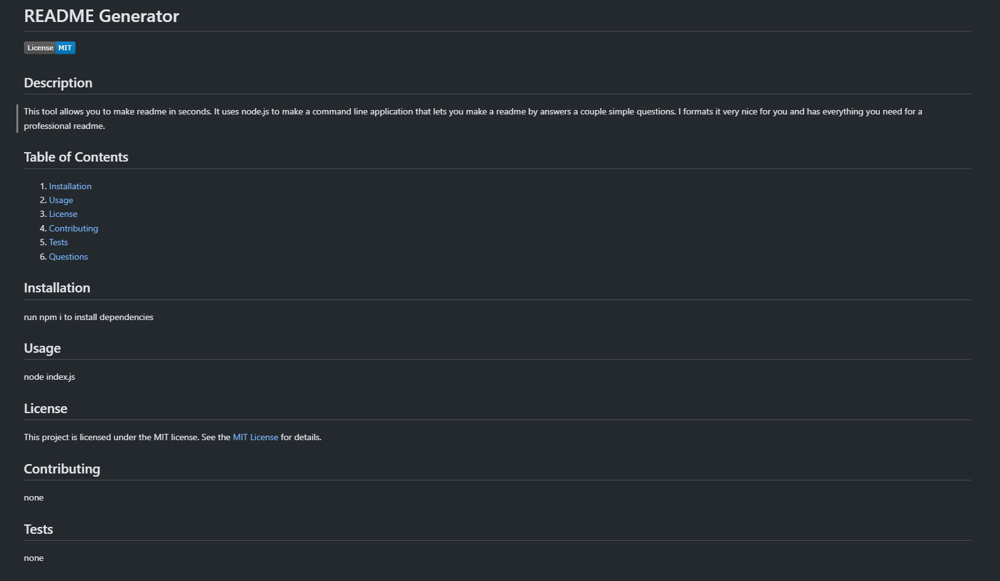

# README Generator

## Description

This tool allows you to make readme in seconds. It uses node.js to make a command line application that lets you make a readme by answers a couple simple questions. I formats it very nice for you and has everything you need for a professional readme.

## Table of Contents

1. [Installation](#installation)
2. [Usage](#usage)
3. [License](#license)
4. [Contributing](#contributing)
5. [Tests](#tests)
6. [Questions](#questions)

## Installation

run npm i to install dependencies

## Usage

node index.js

## License

This project is licensed under the MIT license. See the [MIT License]([License](https://opensource.org/licenses/MIT)) for details.

## Contributing

none

## Tests

none

## Questions

For questions about the project, please feel free to contact me via GitHub: [masonamc5](https://github.com/masonamc5) or via email at masonamc5@gmail.com.
